# NFC verifier - Cloud service (AWS CloudFormation Template)
This document of AWS cloud templates will assist you in quickly getting started with Infineon NFC verifier cloud setup and create your own cloud server.

#Warning: For demonstration and evaluation purposes only
These templates are only example implementations to enable easy setup of AWS cloud infrastructure for demonstrations.
For production purposes, the implementation shall have adequate security measures to take care of security critical assets such as keys and tokens. Please refer to security risks and guidance on [OWASP](https://owasp.org/) for additional information.

## Contents
1. [LambdaFiles](../AWSTemplates/LambdaFiles/):
     This folder contains the AWS Lambda services in the form of JAR libraries.
      
2. [WebData](../AWSTemplates/WebData/):
     This folder contains the source files of the Landing webpage such as HTML, CSS, JS, etc.
      
3. [TableData](../AWSTemplates/TableData/):  It includes a predefined data set that is used to initialize the database tables with default values.	
	  
4. [JSON files](../AWSTemplates/):
     The AWS CloudFormation template files (JSON files) in this folder define the configuration of brand protection cloud services, such as Lambdas, S3 buckets, database tables, APIs etc.
      
5.	[CloudFormationTemplate.bat](../AWSTemplates/): 
	 This batch file executes the template files in the AWS account and creates the AWS infrastructure for brand protection. 
	  
6.	[LandingPageScript.template](../AWSTemplates/):
	 This script is used by CloudFormationTemplate.bat to edit and upload the landing page.
	  
7.	[StepsToConfigureAWSCLI.md](../AWSTemplates/):
	 This file contains the instructions to setup the AWS CLI. 
	  

## Prerequisite
1. An AWS account is required to deploy the CloudFormation templates. A new AWS account can be created by following the instructions [here](https://aws.amazon.com/premiumsupport/knowledge-center/create-and-activate-aws-account/).

2. Install the AWS Command Line Interface and configure user access according to the [documentation](../AWSTemplates/StepsToConfigureAWSCLI.md).

3. Ensure that Windows PowerShell 5.1 or above is installed. (Type `$PSVersionTable` in the PowerShell terminal to get the version information)

## Steps to deploy AWS CloudFormation Template:
:warning: **Warning**: Before performing these steps, the AWS account and AWS region in which the template should be executed, must be configured using the ['aws configure'](../AWSTemplates/StepsToConfigureAWSCLI.md) command. The resources in this template are created using the configured AWS account and AWS region. 

1. Download and extract the CloudFormation Templates from the repository. 

2. Open the Command Prompt (`Start -> Windows System -> Command Prompt`).

3. Navigate to the CloudFormation Templates directory with the following command.

        cd C:\Templates

4. Execute the **CloudFormationTemplate.bat** to deploy the templates in the AWS account. 

        CloudFormationTemplate.bat

    Wait until the resources are created.

    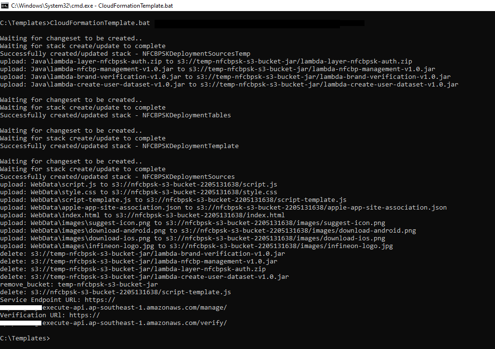
    
    On successful completion, the service endpoint URL and the verification URL will be displayed which will be used in the following steps.

## Configuration via AWS dashboard

Due to certain limitation in the AWS CloudFormation service,
the linking of API gateway GET methods to the Lambda functions are not done properly. Therefore, the following APIs must be manually linked:
- `/keys/GET` to be linked with `brandprotect-list-keys`
- `/products/GET` to be linked with `brandprotect-list-products` 

Please follow the instructions below to manually link the Lambda functions:

1. Login to the AWS account via web browser and select the required AWS Region.

    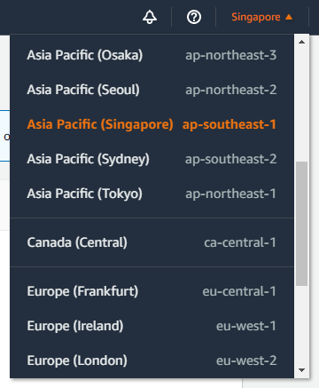

2. Search for 'API Gateway' Service.
    
    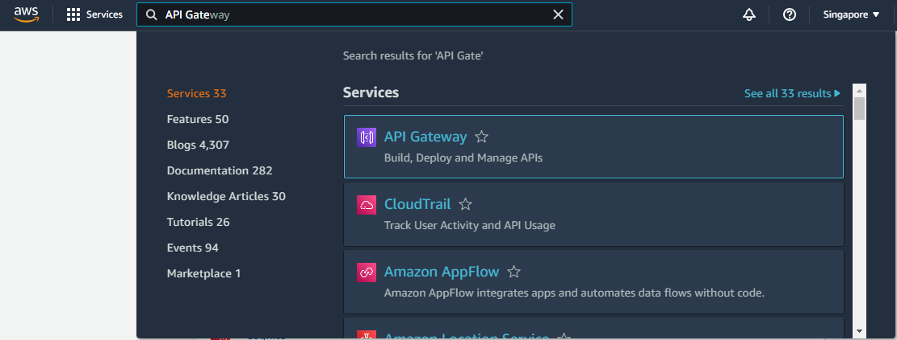

    a. Select the ‘brandprotect-management’ API.

    b. Select ‘Resources’ and select / -> /keys -> GET -> Integration Request.

    c. Select Integration Request and the request details will be displayed.

    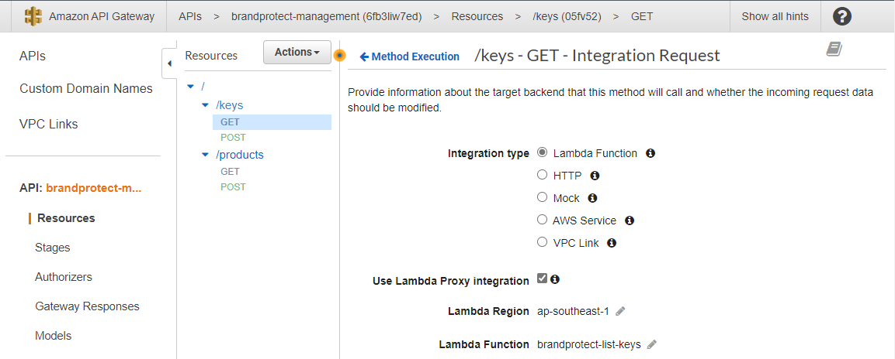

    d. Edit the Lambda Function and type the same function name. 

    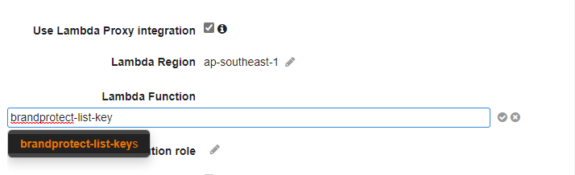

    e. Click the tick icon next to the edit field.
    
    f. In the pop-up window, click 'OK' to confirm the change.
    
    g. Repeat the same steps on /products -> GET -> Integration Request and confirm the changes.
    
    h. Select 'Deploy API' from the 'Actions' drop-down.

    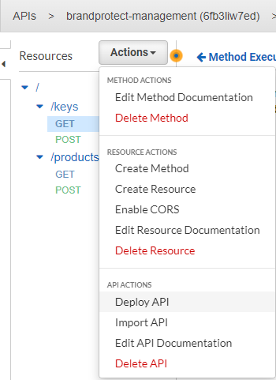

    i. Select 'manage' as the Deployment stage and click 'Deploy'.

    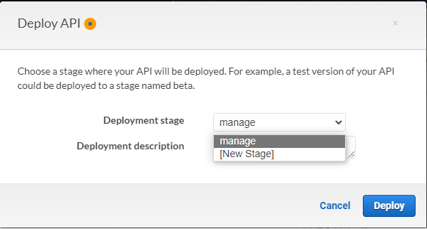

## Verification of the deployed services

The following steps are used to verify the deployed services:

1. Launch the 'Infineon secured NFC tag IDE' and select the settings option from the toolbar.

2. In the preference window, click the 'Cloud settings' button in the left pane. Change the URL for the Login and Service Endpoint. After updating both the URLs, click 'Apply and Close'.

    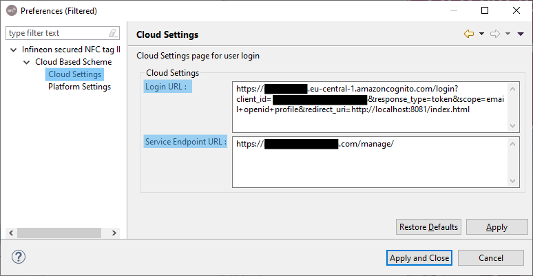
   
   The URLs can be obtained from the following methods:
   
   a. For login URL: `AWS Cognito -> Manage User Pools -> IdentityPool -> AppClient Setting -> Launch Hosted UI -> Copy the URL -> Change response type to token in URL`

   b. For Service endpoint URL, copy the URL from API gateway `(API Gateway -> brandprotect-management -> Stages -> Select manage -> Copy invoke URL)` or from the command prompt.

   c. For Verification URL, copy the URL from API gateway `(API Gateway -> brandprotect -> Stages -> Select verify -> Copy invoke URL)` or from the command prompt.

   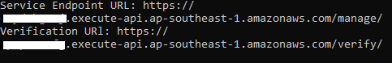
   
3. In the Cloud Manager panel, click the login icon and provide the AWS Cognito credentials to login to the cloud service.
	
    Note: AWS Cognito users can be created through the AWS Web Console with the following steps: 
    
    `AWS Cognito -> Manage User Pools -> IdentityPool -> Users and groups -> Create user`

4. In the NFC Design View panel, browse through  `NFC Application -> EF.NDEF -> NFC Records -> Record 2` and update the Verification URL.

    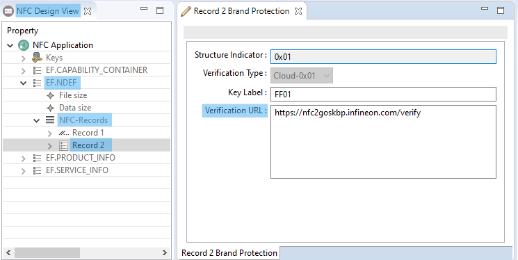

5. To update the landing webpage in the tag, change the Record 1 URI with the landing webpage URL, which can be obtained from `S3 -> nfcbpsk-s3-bucket-xxxxxxxxxx -> index.html -> Copy URL`.

    Note: The product code should be added at the end of the URI with URL query parameter (p) (Example: https://nfc2goskbp.infineon.com/index.html?p=FE01) so that the user is redirected to correct page.
    
    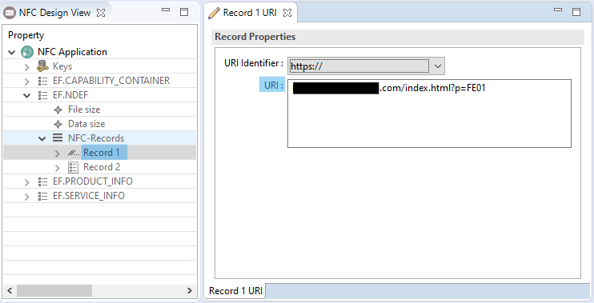

6. With the help of quick access bar buttons, the user can personalize and brand verify the tag. 

 Note: If the 'Infineon secured NFC tag IDE' throws "PKIX path building failed" while connecting to the cloud service, follow the instructions mentioned in Chapter-6 (Import the certificate as a trusted certificate) of the 'Infineon secured NFC tag IDE' user guide.
## Steps to remove the configured template from AWS account 

1. Delete the CloudFormation Template stacks. 
    `CloudFormation -> Stacks -> NFCBPSKDeploymentSources -> Delete`
2. Repeat the same procedure for the following stacks:

    a. NFCBPSKDeploymentTemplate
        
    b. NFCBPSKDeploymentTables
        
    c. NFCBPSKDeploymentSourcesTemp    

3. Delete the S3 bucket prefixed with name 'nfcbpsk-s3-bucket-xxxxxxxxxx'.
    `S3 -> nfcbpsk-s3-bucket-xxxxxxxxxx -> empty bucket configuration -> Delete`
