# Steps to configure AWS CLI:
The following are the steps to install and configure the prerequisites for using the AWS command line interface (CLI) on your Windows host:

1. Download the [AWS CLI setup](https://awscli.amazonaws.com/AWSCLIV2.msi) file.

2. Open the downloaded AWS CLI setup file and follow the installation screen.
    
    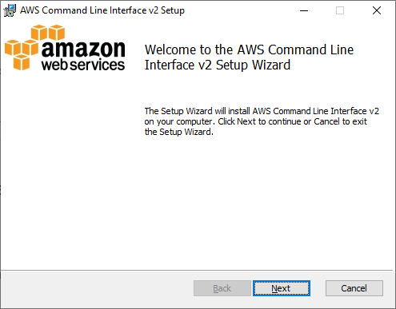
    
3. Accept the End-User License Agreement and proceed to install in the default location. 

    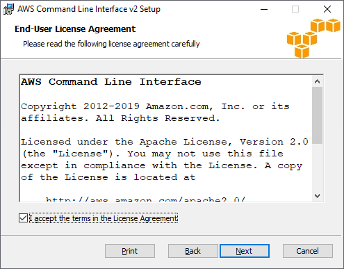

    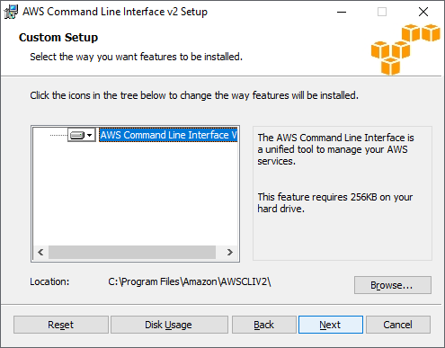

4. Complete the installation process and click 'Finish'.

     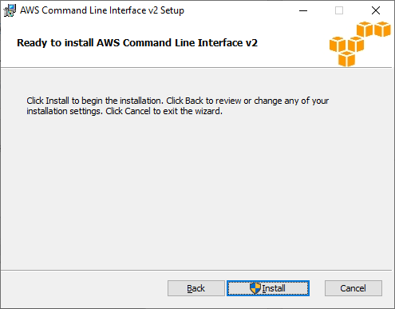

     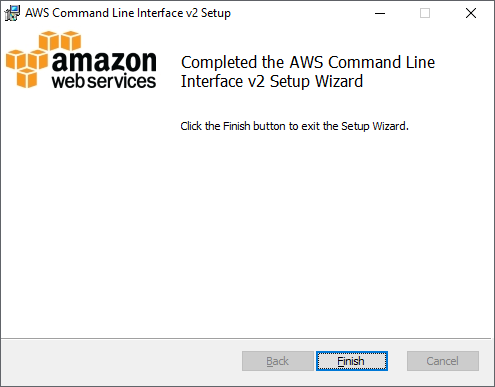

5. Configure IAM permissions and AWS credentials as follow:

    a. Login to your AWS account and select 'IAM' user service from the service list.
    
    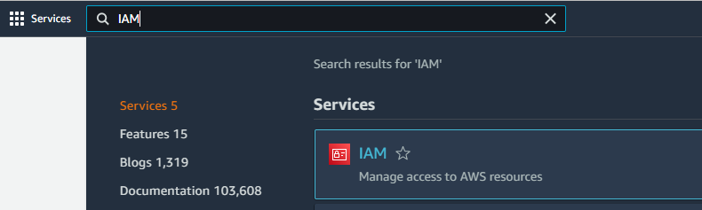

    b. Select 'User groups' from the 'Access management' and then click the 'Create group' button.

    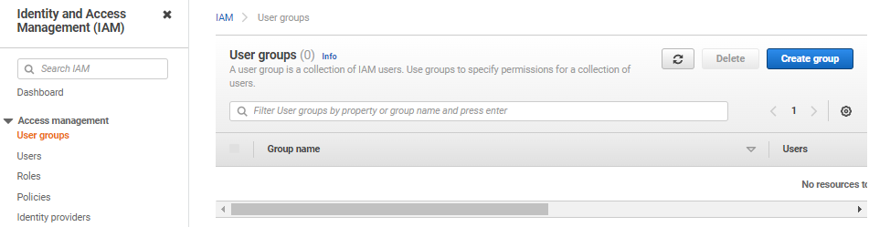

    c. Type the name of the group in the text box.
    
    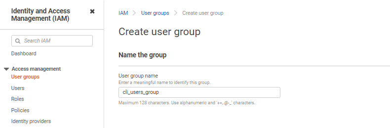

    d. Select the Permission policy as “AdministratorAccess” using the filter and click the 'Create group' button.
    
    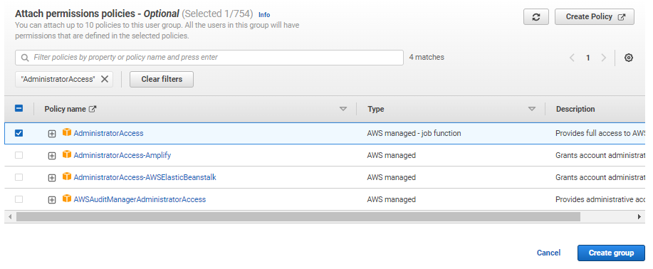

    e. Select 'Users' from the 'Access management' and click the 'Add users' button..
        
    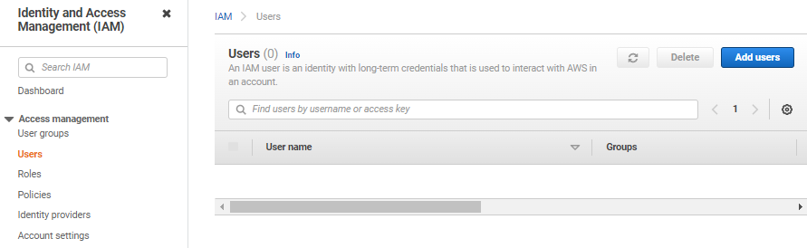

    f. Type the user name and select AWS credentials types as 'Access key-programmatic access' and click on 'Next: Permissions' button.

    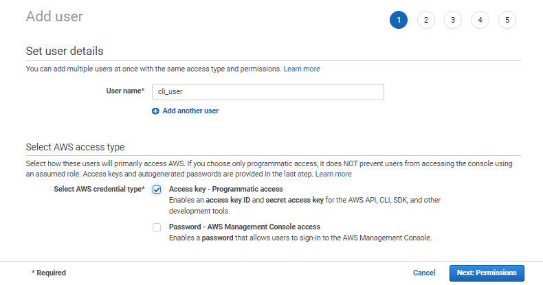

    g. To add a user to a group, select the group name you created and then click on 'Next: Tags' button.        
    
    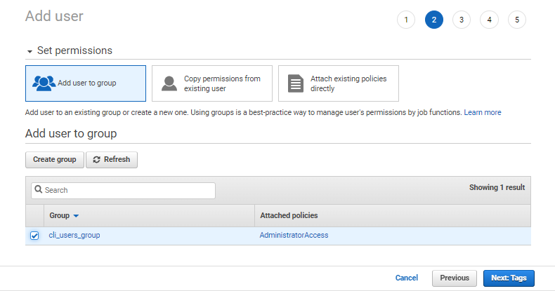

    h. Adding tags are optional. Click 'Next: Review' button to skip adding tags.  

    i. Review the content and click on 'Create user' button.
        
    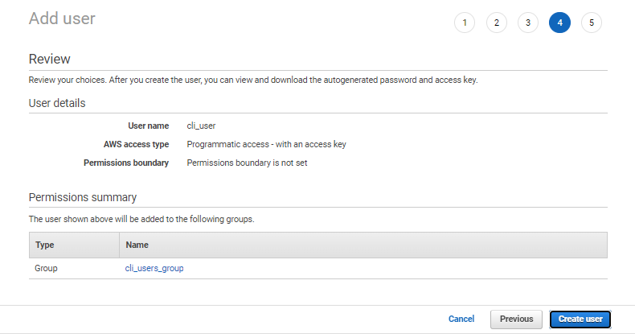

    j. Download the credential CSV file.
    
    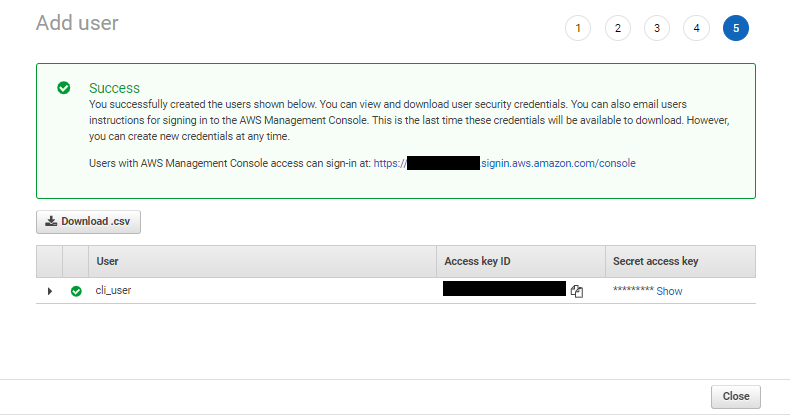

6. Enter the following command to access AWS CLI. The sample values are shown in the example below. Replace 
them with the values from the CSV file.

        $ aws configure
        
        AWS Access Key ID [None]: EXAMPLEEXAMPLEEXAMPLE
        AWS Secret Access Key [None]: EXAMPLEEXAMPLEEXAMPLE
        Default region name [None]: eu-central-1
        Default output format [None]: json
