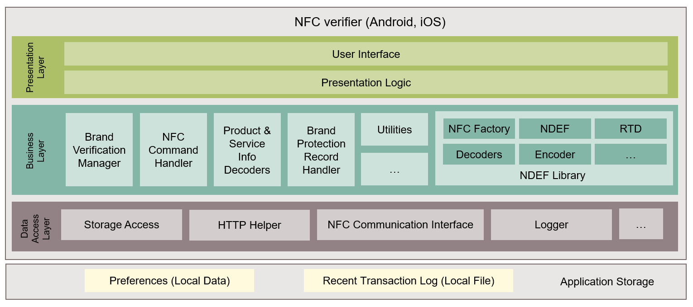

# NFC verifier - iOS Application

The Infineon NFC verifier mobile application, which is included in the [NFC 2Go starter kit for brand protection](https://www.infineon.com/cms/en/product/evaluation-boards/nfc-brand-protect-kit/) is used to demonstrate the brand verification functionality of products with Infineon Secured NFC tags. This application verifies the authenticity of the Secured NFC tag and displays product information. 

The Infineon NFC verifier - iOS application is available for download from the [Apples App Store.](https://apps.apple.com/us/developer/infineon-technologies-ag/id469396533/)

The folder contains project source codes and libraries of the NFC verifier app for iOS. Functionally, this project correlates with the Infineon NFC verifier app available in App Store, but with a simplified UI. This can be used to implement a customized brand protection solution to meet the usecase needs.

## Architecture
The architecture diagram of this application is shown below.

 The NFC verifier application architecture contains the following components: 
- **Presentation layer:** 
     The presentation layer contains the user interface components, user interaction handlers and presentation logic of the application. This includes Android activities, fragments, adapters and view models.  

- **Business layer:**
     The business layer contains the application logic to perform brand verification. This includes services and handlers such as brand verification manager, NFC command handler, brand protection record handler, product and service information decoders and parser for NDEF records.

- **Data access layer:**
     The data access layer comprises of components such as local data store helper, HTTP helper, NFC communicator and logger.

## Supported features
The NFC verifier application supports the following key features:
- Read brand protection pre-defined application profiles (For more information on the pre-defined application profiles, refer [NFC 2Go starter kit for brand protection user guide](../../Documents/UserGuide/NFC2GoSKBP_UG_2022-06-08-Rev1-0__.pdf))
- Perform authentication with the cloud service
- Display product information
- Display service information
- Display the recent transaction log including APDUs

## Requirements
- Mac with Xcode (V12 or higher)
- NFC-enabled iPhone (iOS 13 and above)
- Secured NFC tags (from [NFC 2Go starter kit for brand protection](https://www.infineon.com/cms/en/product/evaluation-boards/nfc-brand-protect-kit/)):
    - NFC4TC304 
    - NFC4TC1K0 
    - NFC4TC2K0 
    - NFC4TC4K0 
    
    For more information, refer [Secured NFC tags](https://www.infineon.com/cms/en/product/security-smart-card-solutions/nfc-solutions/secured-nfc-tags/).
    
## Getting started

1. Download the `NFCVerifier_iOS` project. 
2. In `Xcode`, open the downloaded project.
3. Clean and build the project.
4. Connect the iPhone to the Mac. 
5. Make sure NFC is turned on in iPhone's `Settings`.
6. Run the project on the iPhone that is connected.
7. When the application prompts to scan the Secured NFC tag, place it near the phone's NFC antenna.

 For more information on how to use this application, see Chapter-3 in [NFC 2Go starter kit for brand protection user guide](../../Documents/UserGuide/NFC2GoSKBP_UG_2022-06-08-Rev1-0__.pdf).

