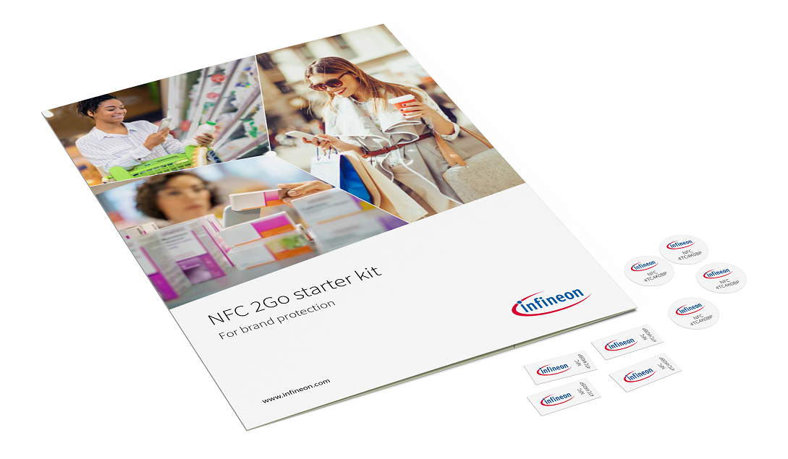

# NFC 2Go starter kit for brand protection
This repository contains the source code and documentation for working with the [NFC 2Go starter kit for brand protection.](https://www.infineon.com/cms/en/product/evaluation-boards/nfc-brand-protect-kit/)

## Getting started
Infineon's [NFC 2Go starter kit for brand protection](https://www.infineon.com/cms/en/product/evaluation-boards/nfc-brand-protect-kit/) offers a brand protection solution that validates the authenticity of a product via NFC. This starter kit allows users to quickly understand, evaluate and implement prototype solutions for brand protection use cases.

This starter kit comes with the following software components:

* ### Infineon NFC verifier - Mobile application (For evaluation)
'Infineon NFC verifier' is a mobile application that can be used to evaluate brand verification process on Infineon Secured NFC tags available in the starter kit. It provides features to verify the authenticity of the product and to read the product information. It is available for download from the [Apple App Store](https://apps.apple.com/us/developer/infineon-technologies-ag/id469396533/) for iPhones and the [Google Play Store](https://play.google.com/store/apps/developer?id=Infineon+Technologies+AG) for Android phones.

* ### Infineon secured NFC tag IDE - Windows application (For evaluation)
'Infineon secured NFC tag IDE' is a Windows-based tool that can be used to evaluate personalization on Infineon Secured NFC tags available in the starter kit. It can be downloaded from [Infineon Developer Center](https://softwaretools.infineon.com/) (Tools -> Search for 'Infineon secured NFC tag IDE').

* ### NFC verifier - Demo mobile application source code and AWS CloudFormation template (For custom development)
The folder contains project source codes and libraries of the NFC verifier app for Android and iOS. Functionally, these projects correlate with the Infineon NFC verifier apps available in Play Store and App Store respectively, but with a simplified UI. This source code and libraries can be used to implement a customized brand protection solution to meet the usecase needs. Also, the provided AWS CloudFormation template can used to create the brand protection cloud infrastructure in any AWS account. 

#Warning: For demonstration and evaluation purposes only
These templates are only example implementations to enable easy setup of AWS cloud infrastructure for demonstrations.
For production purposes, the implementation shall have adequate security measures to take care of security critical assets such as keys and tokens. Please refer to security risks and guidance on [OWASP](https://owasp.org/) for additional information.
 
 

## Contents of this repository

1. [NFC verifier - Android application:](./Mobile/NFCVerifier_Android) 
The source code and libraries of NFC-based brand protection demonstration application for Android platform.
     
     
2. [NFC verifier - iOS application:](./Mobile/NFCVerifier_iOS) 
The source code and libraries of NFC-based brand protection demonstration application for iOS platform.
     
     
3.  [NFC verifier - Cloud service:](./CloudService/AWSTemplates) 
Template to create brand verification cloud service infrastructure in AWS.
     
     
4. [Documentation:](./Documents) User guide of NFC 2Go Starter Kit For Brand Protection and release notes of Infineon NFC verifier mobile applications and cloud services.
     
     

